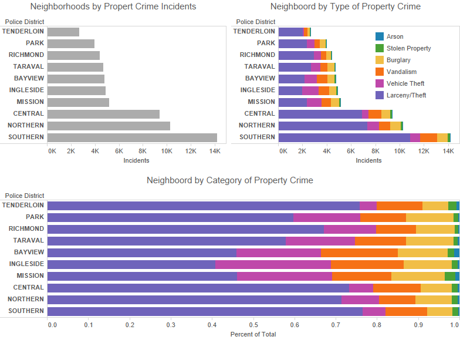

# Homework 1 - Bar Charts #

For this homework assignment, you must visualize the SF Property Crimes 2015 dataset using a horizontal bar chart in D3.js. See below for details.

## Grade Breakdown ##

The grade for this homework will be broken down as follows:

| Points | Details             |
|:------:|:--------------------|
| 50     | Core Functionality  |
| 40     | Extra Functionality |
| 10     | Submission Details  |

:clock1130: In general, homework assignments are designed such that achieving a 60% (D-) requires minimum effort, achieving a 70% to 80% (C- to B-) requires moderate effort, and achieving 90% to 100% (A- to A+) requires significant effort.

:warning: **You may not earn credit for extra functionality unless you receive a 100% on the core functionality.**

## Core Functionality ##

You must fully complete the following core functionality before working on extra functionality:

- [ ] `40pt` Create a **horizontal bar chart** that encodes neighborhood vertically along the y-axis and total number of incidents along the x-axis.
- [ ] ` 5pt` Sort the bars along the y-axis by total number of incidents (not alphabetically).
- [ ] ` 5pt` Add necessary annotations. This includes an x-axis line, x-axis tick marks, x-axis tick labels, y-axis tick labels (but no axis line or tick marks), label text to the x-axis, and title text to the entire visualization.

Once you have completed the above, you may begin on extra functionality.

## Extra Functionality ##

You may complete the following extra functionality in any order:

- [ ] `20pt` Create a **stacked horizontal bar chart** that encodes the category of property crime with color. Use the same sorting and annotations as before.
- [ ] `20pt` Create a **normalized (100%) stacked horizontal bar chart** that encodes the category of property crime with color. Use the same sorting and annotations as before.
- [ ] ` 5pt` Add **color legend** to your stacked bar chart(s). If you use the same colors in multiple charts, you only need to include the legend once.

:+1: You can earn extra credit by completing extra functionality. Your final grade will be capped at 105% total. (A little goes a long way!)

## Submission Details ##

Create one SVG per visualization. Each SVG should be no more than 960 by 500 pixels. You can decide whether to place multiple SVGs on the same webpage, or link to separate webpages each with a single visualization.

Place your homework submission in a subdirectory of your submission repository named `homework1` without spaces in all lowercase. Your submission should be accessible via the link:

```
http://usf-cs360-2016.github.io/templates-cs360/homework1/
```

Replace `templates` with your MyUSF username, double-check the link works, and then submit it in Canvas by the deadline.

:warning: You must use [D3.js](http://d3js.org/) to complete this assignment. You are always welcome to use a tool like [Tableau](http://www.tableau.com/academic/students) or [Tableau Public](http://www.tableau.com/products/public) to prototype your visualizations, but you will not earn credit for submissions using Tableau. Nor will you earn credit if you submit visualizations using libraries built on-top of D3, such as NVD3, C3.js, or dimple.

## Example ##

See this [Tableau Public Workbook](https://public.tableau.com/views/SFPropertyCrimes2015/Examples?:embed=y&:display_count=yes&:showTabs=y) for example visualizations of this dataset. You do not need to recreate these exactly for this assignment. 



## Sources ##

The data comes from the [SFPD Incidents](https://data.sfgov.org/Public-Safety/SFPD-Incidents-from-1-January-2003/tmnf-yvry) dataset from [SF OpenData](https://data.sfgov.org/). The following filters were applied before calculating totals:

- Only incidents from 2015-01-01 to 2015-12-31 were included.

- Only incidents from the following categories were included: VEHICLE THEFT, LARCENY/THEFT, ARSON, BURGLARY, VANDALISM, STOLEN PROPERTY.

The data was then uploaded to [Google Spreadsheet](https://docs.google.com/spreadsheets/d/1TRDV3psBTJ-FcS4RKwF6qLstIwEm3AwAleGJSbA1TsM/edit?usp=sharing), where a pivot table was created to generate the final totals.

Visit [sf-policy.org](http://sf-police.org/Modules/ShowDocument.aspx?documentid=27484) for a map of police districts.

## References ##

THe following tutorials will help you understand the [D3.js](http://d3js.org/) framework.

- [Let's Make a Bar Chart](http://bost.ocks.org/mike/bar/)
- [Thinking With Joins](http://bost.ocks.org/mike/join/)
- [Three Little Circles](http://bost.ocks.org/mike/circles/)
- [How Selections Work](http://bost.ocks.org/mike/selection/)

The following blocks may be useful for creating bar charts:

- [Bar Chart](http://bl.ocks.org/mbostock/3885304)
- [Stacked Bar Chart](http://bl.ocks.org/mbostock/3886208)
- [Normalized Stacked Bar Chart](http://bl.ocks.org/mbostock/3886394)

You may use existing examples as inspiration, but the final product must be your own. Remember to cite all your sources and inspirations in your code and README to avoid any issues with academic honesty.
